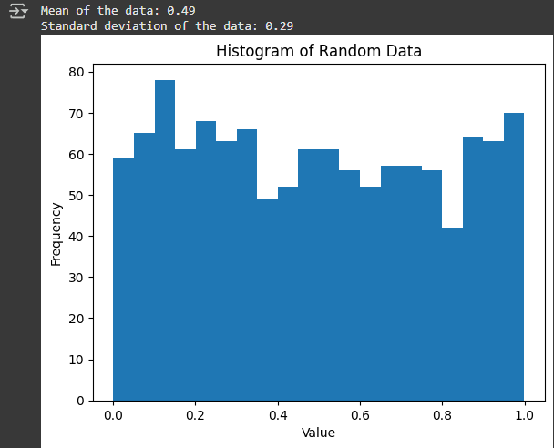

# 🐍 Python Basics – Day 1 (Colab Notebook)

This notebook represents **Day 1 of my journey into Python programming**. It's my first hands-on exploration of the language, and I used Google Colab to follow along, test ideas, and understand foundational concepts in a practical way.

## 📘 What I Learned

Here’s a breakdown of what I personally learned through this project:

- ✅ **How to print to the console** using `print()`
- ✅ **Writing comments** to explain or disable code
- ✅ **Creating and using variables** of different types:  
  - Strings (`str`)  
  - Integers (`int`)  
  - Floats (`float`)  
  - Booleans (`bool`)
- ✅ **How to check data types** using `type()`  
- ✅ **Basic arithmetic operations** and how Python handles math
- ✅ **String manipulation**, including:
  - Changing case with `.upper()` and `.lower()`
  - Finding the length of strings with `len()`
- ✅ **Using `input()`** to take user input and convert it with `int()` or `str()`
- ✅ **Using NumPy** to generate random data and perform statistical calculations like mean and standard deviation
- ✅ **Using Matplotlib** to create a histogram and visualize data distributions


## 📥 Where to Find the Notebook

You can find the notebook file [`Yusaf Malik Python Basic Day 1.ipynb`](./Yusaf%20Malik%20Python%20Basic%20Day%201.ipynb) directly in this repository. It can be opened in Jupyter Notebook or uploaded to Google Colab for interactive use.

## 🧠 Examples of My Code

```python
# Simple addition using user input
import numpy as np

print("Input the first number")
A = int(input())
print("Input the second number")
B = int(input())

SUM = A + B

print(f"The sum of {A} and {B} is {SUM}")
```

```python
# A simple calculator with conditionals
print("Input the style of execution you require")
C = input()  # Operation: *, /, +, -

if C == "*":
    SUM = A * B
elif C == "/":
    SUM = A / B
elif C == "+":
    SUM = A + B
elif C == "-":
    SUM = A - B
else:
    print("Invalid input")

print(f"The result is {SUM}")
```

```python
# More efficient calculator using lambdas
a = int(input("First number: "))
b = int(input("Second number: "))
op = input("Operation (*, /, +, -): ").strip()

ops = {
    '+': lambda x, y: x + y,
    '-': lambda x, y: x - y,
    '*': lambda x, y: x * y,
    '/': lambda x, y: x / y if y != 0 else "Error: can't divide by zero"
}

if op in ops:
    result = ops[op](a, b)
    print(f"The result of {a} {op} {b} is {result}")
else:
    print("Invalid operator. Use *, /, +, or -.")
```

## 📊 Data Analysis and Visualisation

```python
# Example of basic data analysis and visualisation with matplotlib
import matplotlib.pyplot as plt
import numpy as np

# Generate some random data
data = np.random.rand(1200)

# Perform a simple analysis (e.g., calculate mean and standard deviation)
mean = np.mean(data)
std_dev = np.std(data)

# Print the results
print(f"Mean of the data: {mean:.2f}")
print(f"Standard deviation of the data: {std_dev:.2f}")

# Create a histogram to visualise the data distribution
plt.hist(data, bins=20)
plt.xlabel("Value")
plt.ylabel("Frequency")
plt.title("Histogram of Random Data")
plt.show()
```
## 🖼️ Output Example: Histogram Visualisation

The following plot is generated using Matplotlib and displays the distribution of 1,200 randomly generated values.

This histogram helps visualise the frequency of values within different ranges (bins), and provides a visual summary of the dataset's distribution:




## 📁 Files in This Project

```
project-folder/
├── Yusaf Malik Python Basic Day 1.ipynb
└── README.md
```

## 🙌 My Reflection

This was a great introduction to Python. I now understand how variables, data types, and basic functions work, and I feel more confident exploring programming in a structured and logical way. It’s only Day 1, but it already feels like the beginning of something important.


## 🙏 Acknowledgements

Special thanks to **Ryan Orsinger** for authoring the original material that helped shape this notebook and learning experience.
